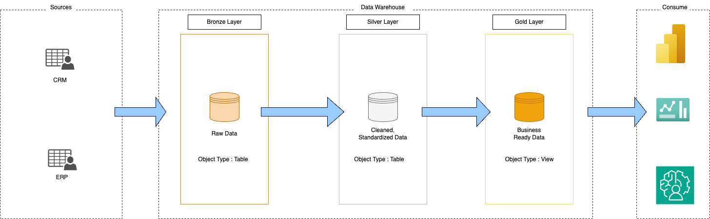

# SQL-Datawarehouse
This is Datawarehouse Project using CRM & ERP data.

A comprehensive project demonstrating how to build and manage a SQL-based data warehouse. This repository showcases best practices in data modeling, ETL processes, and analytical querying.

## Table of Contents

1. [Overview](#overview)
2. [Features](#features)

---

## Overview

**SQL-Datawarehouse** provides a blueprint for designing and implementing a data warehouse in a relational database. It focuses on:

- **Schema Creation** (using DDL scripts)
- **Data Loading** (staging, transformation, and insertion into fact/dimension tables)

This project is ideal for anyone looking to understand core data warehousing concepts and apply them in a real-world SQL environment.

---

## Features

- **Dimensional Modeling**: Star schema design (fact and dimension tables) for optimized queries
- **ETL Scripts**: Automated data loading and transformation

---

